# 💰 PLAN MAESTRO: OPTIMIZACIÓN DE COSTOS

> **Objetivo:** Reducir costos de infraestructura de $60,000 USD/año a $0 USD/año mediante migración a servicios open-source y optimización de recursos.

---

## 📊 RESUMEN EJECUTIVO

| Categoría | Servicio Actual | Costo Anual | Alternativa | Nuevo Costo | Ahorro |
|-----------|----------------|-------------|-------------|-------------|---------|
| **Mapas** | Google Maps API | $42,000 | Leaflet + OSM | $0 | **$42,000** |
| **Geocoding** | Google Geocoding | $15,000 | Nominatim | $0 | **$15,000** |
| **Imágenes** | Sin optimizar | $3,000 | Sharp + WebP | $0 | **$3,000** |
| **WhatsApp** | N/A | $0 | Baileys (gratis) | $0 | $0 |
| **TOTAL** | - | **$60,000** | - | **$0** | **$60,000** |

---

## 🎯 ESTRUCTURA DE EQUIPOS

```mermaid
graph TD
    A[FASE 2: OPTIMIZACIÓN DE COSTOS] --> B[👥 EQUIPO CHARLIE<br/>Maps & Geocoding]
    A --> C[👥 EQUIPO DELTA<br/>Image Processing]
    A --> D[👥 EQUIPO ECHO<br/>WhatsApp Integration]

    B --> B1[Charlie-1: Leaflet Migration]
    B --> B2[Charlie-2: Geocoding Service]

    C --> C1[Delta-1: Image Optimization]
    C --> C2[Delta-2: Storage Management]

    D --> D1[Echo-1: WhatsApp Web Service]
    D --> D2[Echo-2: Contact Integration]
```



---

# 🗺️ EQUIPO CHARLIE: Maps & Geocoding

## 👤 Agente Charlie-1: Leaflet Migration

**Responsabilidad:** Migrar completamente de Google Maps a Leaflet.js

**Ahorro estimado:** $42,000 USD/año

### Prompt para Cursor + Claude Opus:

```markdown
Actúa como Frontend Engineer especializado en mapas interactivos.

CONTEXTO:
- Librería actual: @react-google-maps/api (costosa: $42K/año)
- Librería objetivo: react-leaflet + OpenStreetMap (gratis)
- Ya instalado: "react-leaflet": "^5.0.0", "leaflet": "^1.9.4"
- Archivos a revisar: src/components/maps/*.tsx

OBJETIVO:
Eliminar 100% de dependencias de Google Maps y reemplazar con Leaflet.js manteniendo toda la funcionalidad.

TAREAS:

1. CREAR COMPONENTE BASE PropertyMap:
```typescript
// src/components/maps/PropertyMap.tsx
'use client'

import { MapContainer, TileLayer, Marker, Popup, useMap } from 'react-leaflet'
import L from 'leaflet'
import 'leaflet/dist/leaflet.css'

// Fix de iconos de Leaflet
delete (L.Icon.Default.prototype as any)._getIconUrl
L.Icon.Default.mergeOptions({
  iconRetinaUrl: 'https://cdnjs.cloudflare.com/ajax/libs/leaflet/1.7.1/images/marker-icon-2x.png',
  iconUrl: 'https://cdnjs.cloudflare.com/ajax/libs/leaflet/1.7.1/images/marker-icon.png',
  shadowUrl: 'https://cdnjs.cloudflare.com/ajax/libs/leaflet/1.7.1/images/marker-shadow.png'
})

interface PropertyMapProps {
  lat: number
  lng: number
  zoom?: number
  properties?: Property[]
  onBoundsChange?: (bounds: { ne: LatLng; sw: LatLng }) => void
  showSearch?: boolean
  className?: string
}

export default function PropertyMap({
  lat,
  lng,
  zoom = 13,
  properties,
  onBoundsChange,
  showSearch,
  className = "h-full w-full rounded-lg"
}: PropertyMapProps) {
  return (
    <MapContainer
      center={[lat, lng]}
      zoom={zoom}
      className={className}
      scrollWheelZoom={true}
    >
      <TileLayer
        attribution='&copy; <a href="https://www.openstreetmap.org/copyright">OSM</a>'
        url="https://{s}.tile.openstreetmap.org/{z}/{x}/{y}.png"
        maxZoom={19}
      />

      {/* Componente para detectar cambios de bounds */}
      {onBoundsChange && <BoundsUpdater onBoundsChange={onBoundsChange} />}

      {/* Marcadores */}
      {properties ? (
        <PropertyMarkers properties={properties} />
      ) : (
        <Marker position={[lat, lng]}>
          <Popup>Ubicación de la propiedad</Popup>
        </Marker>
      )}

      {/* Buscador de direcciones */}
      {showSearch && <MapSearchControl />}
    </MapContainer>
  )
}

// Hook para detectar cambios de bounds
function BoundsUpdater({ onBoundsChange }: { onBoundsChange: (bounds: any) => void }) {
  const map = useMap()

  useEffect(() => {
    function handleMoveEnd() {
      const bounds = map.getBounds()
      onBoundsChange({
        ne: { lat: bounds.getNorth(), lng: bounds.getEast() },
        sw: { lat: bounds.getSouth(), lng: bounds.getWest() }
      })
    }

    map.on('moveend', handleMoveEnd)
    return () => { map.off('moveend', handleMoveEnd) }
  }, [map, onBoundsChange])

  return null
}
```

2. CREAR MARCADORES PERSONALIZADOS:
```typescript
// src/components/maps/PropertyMarkers.tsx
import { Marker, Popup } from 'react-leaflet'
import { divIcon } from 'leaflet'
import { renderToString } from 'react-dom/server'

interface PropertyMarkersProps {
  properties: Property[]
  onPropertyClick?: (property: Property) => void
}

function PropertyMarkers({ properties, onPropertyClick }: PropertyMarkersProps) {
  return (
    <>
      {properties.map((property) => {
        const icon = divIcon({
          className: 'custom-marker',
          html: renderToString(
            <div className="relative">
              <div className="bg-blue-600 text-white px-2 py-1 rounded-lg shadow-lg text-sm font-semibold whitespace-nowrap">
                ${(property.price / 1000000).toFixed(1)}M
              </div>
              <div className="absolute left-1/2 -bottom-1 transform -translate-x-1/2 w-0 h-0 border-l-4 border-r-4 border-t-4 border-transparent border-t-blue-600" />
            </div>
          ),
          iconSize: [80, 40],
          iconAnchor: [40, 40]
        })

        return (
          <Marker
            key={property.id}
            position={[property.lat, property.lng]}
            icon={icon}
            eventHandlers={{
              click: () => onPropertyClick?.(property)
            }}
          >
            <Popup>
              <PropertyPopup property={property} />
            </Popup>
          </Marker>
        )
      })}
    </>
  )
}
```

3. CREAR POPUP PERSONALIZADO:
```typescript
// src/components/maps/PropertyPopup.tsx
import Image from 'next/image'
import Link from 'next/link'
import { formatCurrency } from '@/lib/utils'

interface PropertyPopupProps {
  property: Property
}

export default function PropertyPopup({ property }: PropertyPopupProps) {
  return (
    <div className="w-64">
      {/* Imagen principal */}
      {property.images?.[0] && (
        <div className="relative h-40 w-full mb-2">
          <Image
            src={property.images[0].thumb || property.images[0].medium}
            alt={property.title}
            fill
            className="object-cover rounded-t"
          />
        </div>
      )}

      {/* Info */}
      <div className="p-2">
        <h3 className="font-bold text-sm mb-1">{property.title}</h3>
        <p className="text-xs text-gray-600 mb-2">{property.address}</p>

        <div className="flex justify-between items-center mb-2">
          <span className="text-lg font-bold text-blue-600">
            {formatCurrency(property.price)}
          </span>
        </div>

        <div className="grid grid-cols-3 gap-2 text-xs mb-3">
          <div>
            <span className="text-gray-500">Recámaras</span>
            <p className="font-semibold">{property.bedrooms}</p>
          </div>
          <div>
            <span className="text-gray-500">Baños</span>
            <p className="font-semibold">{property.bathrooms}</p>
          </div>
          <div>
            <span className="text-gray-500">m²</span>
            <p className="font-semibold">{property.area}</p>
          </div>
        </div>

        <Link
          href={`/propiedades/${property.id}`}
          className="block w-full text-center px-3 py-1.5 bg-blue-600 text-white rounded text-sm hover:bg-blue-700"
        >
          Ver detalles
        </Link>
      </div>
    </div>
  )
}
```

4. CREAR CONTROL DE BÚSQUEDA:
```typescript
// src/components/maps/MapSearchControl.tsx
'use client'

import { useState } from 'react'
import { useMap } from 'react-leaflet'
import { Search } from 'lucide-react'
import { geocodeAddress } from '@/lib/geocoding/nominatim'

export default function MapSearchControl() {
  const map = useMap()
  const [query, setQuery] = useState('')
  const [results, setResults] = useState([])
  const [loading, setLoading] = useState(false)

  async function handleSearch() {
    if (!query.trim()) return

    setLoading(true)
    try {
      const response = await fetch('/api/geocoding/search', {
        method: 'POST',
        headers: { 'Content-Type': 'application/json' },
        body: JSON.stringify({ query })
      })
      const data = await response.json()
      setResults(data)
    } catch (error) {
      console.error('Search error:', error)
    } finally {
      setLoading(false)
    }
  }

  function handleSelectResult(result: any) {
    map.flyTo([result.lat, result.lng], 15, {
      duration: 1.5
    })
    setResults([])
    setQuery('')
  }

  return (
    <div className="leaflet-top leaflet-left" style={{ marginTop: '80px' }}>
      <div className="leaflet-control bg-white shadow-lg rounded-lg p-3 w-80">
        <div className="flex gap-2 mb-2">
          <input
            type="text"
            value={query}
            onChange={(e) => setQuery(e.target.value)}
            onKeyPress={(e) => e.key === 'Enter' && handleSearch()}
            placeholder="Buscar ubicación..."
            className="flex-1 px-3 py-2 border rounded"
          />
          <button
            onClick={handleSearch}
            disabled={loading}
            className="px-4 py-2 bg-blue-600 text-white rounded hover:bg-blue-700 disabled:opacity-50"
          >
            <Search className="w-4 h-4" />
          </button>
        </div>

        {results.length > 0 && (
          <div className="max-h-60 overflow-y-auto">
            {results.map((result, index) => (
              <div
                key={index}
                onClick={() => handleSelectResult(result)}
                className="p-2 hover:bg-gray-100 cursor-pointer border-t text-sm"
              >
                {result.display_name}
              </div>
            ))}
          </div>
        )}
      </div>
    </div>
  )
}
```

5. INTEGRAR EN PÁGINAS EXISTENTES:

   A) Web pública - Búsqueda con mapa:
```typescript
// src/app/propiedades/page.tsx
'use client'

import dynamic from 'next/dynamic'
import { useState } from 'react'
import { useProperties } from '@/hooks/useProperties'

const PropertyMap = dynamic(() => import('@/components/maps/PropertyMap'), {
  ssr: false,
  loading: () => <div className="h-[600px] bg-gray-100 animate-pulse rounded-lg" />
})

export default function PropiedadesPage() {
  const [bounds, setBounds] = useState(null)
  const [filters, setFilters] = useState({})

  const { data: properties, isLoading } = useProperties({
    bounds,
    ...filters
  })

  return (
    <div className="grid grid-cols-1 lg:grid-cols-2 gap-4 h-screen">
      {/* Lista de propiedades */}
      <div className="overflow-y-auto">
        <PropertyList
          properties={properties}
          isLoading={isLoading}
        />
      </div>

      {/* Mapa */}
      <div className="sticky top-0 h-screen">
        <PropertyMap
          lat={19.4326}
          lng={-99.1332}
          zoom={11}
          properties={properties}
          onBoundsChange={setBounds}
          showSearch
        />
      </div>
    </div>
  )
}
```

   B) Detalle de propiedad:
```typescript
// src/app/propiedades/[id]/page.tsx
import dynamic from 'next/dynamic'

const SinglePropertyMap = dynamic(
  () => import('@/components/maps/SinglePropertyMap'),
  { ssr: false }
)

export default async function PropertyDetailPage({ params }: { params: { id: string } }) {
  const property = await getProperty(params.id)

  return (
    <div>
      {/* ... otros detalles ... */}

      <section className="mt-8">
        <h2 className="text-2xl font-bold mb-4">Ubicación</h2>
        <div className="h-[400px] rounded-lg overflow-hidden">
          <SinglePropertyMap
            lat={property.lat}
            lng={property.lng}
            zoom={15}
          />
        </div>
      </section>
    </div>
  )
}
```

   C) Backoffice - Captaciones paso 2:
```typescript
// src/app/backoffice/captaciones/step-2-ubicacion.tsx
'use client'

import dynamic from 'next/dynamic'
import { useState } from 'react'

const LocationPicker = dynamic(
  () => import('@/components/maps/LocationPicker'),
  { ssr: false }
)

export default function StepUbicacion({ formData, updateFormData }) {
  const [coordinates, setCoordinates] = useState({
    lat: formData.lat || 19.4326,
    lng: formData.lng || -99.1332
  })

  function handleLocationChange(newCoords: { lat: number; lng: number }) {
    setCoordinates(newCoords)
    updateFormData({
      lat: newCoords.lat,
      lng: newCoords.lng,
      coordinates: `POINT(${newCoords.lng} ${newCoords.lat})`
    })
  }

  return (
    <div>
      <h2 className="text-xl font-bold mb-4">Ubicación de la propiedad</h2>

      <div className="h-[500px] rounded-lg overflow-hidden mb-4">
        <LocationPicker
          initialLat={coordinates.lat}
          initialLng={coordinates.lng}
          onChange={handleLocationChange}
        />
      </div>

      <div className="grid grid-cols-2 gap-4">
        <div>
          <label className="block text-sm font-medium mb-1">Latitud</label>
          <input
            type="number"
            value={coordinates.lat}
            readOnly
            className="w-full px-3 py-2 border rounded bg-gray-50"
          />
        </div>
        <div>
          <label className="block text-sm font-medium mb-1">Longitud</label>
          <input
            type="number"
            value={coordinates.lng}
            readOnly
            className="w-full px-3 py-2 border rounded bg-gray-50"
          />
        </div>
      </div>
    </div>
  )
}
```

6. ELIMINAR DEPENDENCIAS:

   A) Desinstalar Google Maps:
```bash
npm uninstall @react-google-maps/api @types/google.maps
```

   B) Limpiar archivos:
```bash
# Buscar y eliminar imports
grep -r "@react-google-maps" src/
grep -r "google.maps" src/
# Eliminar archivos que usen Google Maps
```

   C) Eliminar variables de entorno:
```bash
# .env.local
# ELIMINAR: NEXT_PUBLIC_GOOGLE_MAPS_API_KEY
```

7. ESTILOS CUSTOMIZADOS:
```css
/* src/app/globals.css */

/* Leaflet overrides */
.leaflet-container {
  font-family: inherit;
  z-index: 0;
}

.custom-marker {
  background: transparent;
  border: none;
}

.leaflet-popup-content-wrapper {
  border-radius: 12px;
  padding: 0;
  overflow: hidden;
}

.leaflet-popup-content {
  margin: 0;
  min-width: 250px;
}

.leaflet-popup-tip {
  display: none;
}

/* Fix para iconos de Leaflet en Next.js */
.leaflet-default-icon-path {
  background-image: url('https://cdnjs.cloudflare.com/ajax/libs/leaflet/1.7.1/images/marker-icon.png');
}
```

ENTREGABLES:
✅ src/components/maps/PropertyMap.tsx (CREAR)
✅ src/components/maps/PropertyMarkers.tsx (CREAR)
✅ src/components/maps/PropertyPopup.tsx (CREAR)
✅ src/components/maps/MapSearchControl.tsx (CREAR)
✅ src/components/maps/SinglePropertyMap.tsx (ACTUALIZAR)
✅ src/components/maps/LocationPicker.tsx (ACTUALIZAR)
✅ src/app/propiedades/page.tsx (ACTUALIZAR)
✅ src/app/propiedades/[id]/page.tsx (ACTUALIZAR)
✅ src/app/backoffice/captaciones/step-2-ubicacion.tsx (ACTUALIZAR)
✅ src/app/globals.css (ACTUALIZAR)
✅ package.json (ELIMINAR @react-google-maps/api)
✅ .env.local (ELIMINAR NEXT_PUBLIC_GOOGLE_MAPS_API_KEY)
✅ docs/MAPS_MIGRATION.md (ACTUALIZAR con más detalles)

TESTING:
- [ ] Verificar que todos los mapas cargan correctamente
- [ ] Probar búsqueda por bounds en mapa
- [ ] Verificar marcadores personalizados con precios
- [ ] Probar popups interactivos
- [ ] Probar en mobile (touch gestures)
- [ ] Comparar performance vs Google Maps
- [ ] Verificar que no hay errores de consola
- [ ] Probar LocationPicker en captaciones
```

**Estado actual:** ✅ COMPLETADO (ver docs/MAPS_MIGRATION.md)

---

## 👤 Agente Charlie-2: Geocoding Service

**Responsabilidad:** Implementar geocodificación estática con Nominatim

**Ahorro estimado:** $15,000 USD/año

### Prompt para Cursor + Claude Opus:

```markdown
Actúa como Backend Engineer especializado en servicios de geolocalización.

CONTEXTO:
- API actual: Google Geocoding ($5 per 1000 requests = $15K/año)
- API objetivo: Nominatim OpenStreetMap (GRATIS con rate limit)
- Estrategia: Geocodificar UNA vez al crear propiedad, guardar en DB
- Rate limit: 1 request/segundo (Nominatim)

OBJETIVO:
Implementar servicio de geocodificación que:
1. Convierta direcciones a coordenadas (lat/lng)
2. Reverse geocoding (coordenadas → dirección)
3. Autocomplete de direcciones
4. Guardar en DB para no re-geocodificar
5. Sistema de caché inteligente

TAREAS:

1. CREAR SERVICIO DE GEOCODING:
```typescript
// src/lib/geocoding/nominatim.ts

const NOMINATIM_BASE = 'https://nominatim.openstreetmap.org'
const USER_AGENT = 'LivooCRM/1.0 (contact@livoo.mx)'

interface GeocodeResult {
  lat: number
  lng: number
  display_name: string
  address: {
    street?: string
    neighborhood?: string
    city?: string
    state?: string
    postcode?: string
    country?: string
  }
  boundingbox?: [string, string, string, string] // [minlat, maxlat, minlon, maxlon]
}

/**
 * Geocodifica una dirección a coordenadas
 * Rate limit: 1 request/segundo
 * @param address - Dirección completa o parcial
 * @param city - Ciudad (opcional, mejora precisión)
 * @param state - Estado (opcional, mejora precisión)
 * @returns Resultado de geocodificación o null si no se encuentra
 */
export async function geocodeAddress(
  address: string,
  city?: string,
  state?: string
): Promise<GeocodeResult | null> {
  const query = [address, city, state, 'México']
    .filter(Boolean)
    .join(', ')

  const params = new URLSearchParams({
    q: query,
    format: 'json',
    addressdetails: '1',
    countrycodes: 'mx',
    limit: '1'
  })

  const url = `${NOMINATIM_BASE}/search?${params}`

  try {
    const response = await fetch(url, {
      headers: {
        'User-Agent': USER_AGENT,
        'Accept-Language': 'es-MX,es;q=0.9'
      }
    })

    if (!response.ok) {
      console.error('Geocoding failed:', response.statusText)
      throw new Error('Geocoding failed')
    }

    const results = await response.json()
    if (results.length === 0) return null

    const result = results[0]

    return {
      lat: parseFloat(result.lat),
      lng: parseFloat(result.lon),
      display_name: result.display_name,
      address: {
        street: result.address.road,
        neighborhood: result.address.suburb || result.address.neighbourhood,
        city: result.address.city || result.address.town || result.address.municipality,
        state: result.address.state,
        postcode: result.address.postcode,
        country: result.address.country
      },
      boundingbox: result.boundingbox
    }
  } catch (error) {
    console.error('Geocoding error:', error)
    return null
  }
}

/**
 * Reverse geocoding: coordenadas → dirección
 * @param lat - Latitud
 * @param lng - Longitud
 * @returns Dirección formateada
 */
export async function reverseGeocode(
  lat: number,
  lng: number
): Promise<GeocodeResult | null> {
  const params = new URLSearchParams({
    lat: lat.toString(),
    lon: lng.toString(),
    format: 'json',
    addressdetails: '1',
    'accept-language': 'es-MX'
  })

  const url = `${NOMINATIM_BASE}/reverse?${params}`

  try {
    const response = await fetch(url, {
      headers: {
        'User-Agent': USER_AGENT,
        'Accept-Language': 'es-MX,es;q=0.9'
      }
    })

    if (!response.ok) throw new Error('Reverse geocoding failed')

    const result = await response.json()

    return {
      lat,
      lng,
      display_name: result.display_name,
      address: {
        street: result.address.road,
        neighborhood: result.address.suburb,
        city: result.address.city || result.address.town,
        state: result.address.state,
        postcode: result.address.postcode,
        country: result.address.country
      }
    }
  } catch (error) {
    console.error('Reverse geocoding error:', error)
    return null
  }
}

/**
 * Autocomplete de direcciones
 * @param query - Texto de búsqueda
 * @param limit - Número máximo de resultados (default: 5)
 * @returns Lista de sugerencias
 */
export async function searchAddresses(
  query: string,
  limit: number = 5
): Promise<GeocodeResult[]> {
  if (query.length < 3) return []

  const params = new URLSearchParams({
    q: query,
    format: 'json',
    addressdetails: '1',
    countrycodes: 'mx',
    limit: limit.toString()
  })

  const url = `${NOMINATIM_BASE}/search?${params}`

  try {
    const response = await fetch(url, {
      headers: {
        'User-Agent': USER_AGENT,
        'Accept-Language': 'es-MX,es;q=0.9'
      }
    })

    if (!response.ok) throw new Error('Address search failed')

    const results = await response.json()

    return results.map((r: any) => ({
      lat: parseFloat(r.lat),
      lng: parseFloat(r.lon),
      display_name: r.display_name,
      address: {
        street: r.address.road,
        neighborhood: r.address.suburb,
        city: r.address.city || r.address.town,
        state: r.address.state,
        postcode: r.address.postcode,
        country: r.address.country
      },
      boundingbox: r.boundingbox
    }))
  } catch (error) {
    console.error('Address search error:', error)
    return []
  }
}

/**
 * Rate limiter: 1 request/segundo
 * Nominatim requiere mínimo 1 segundo entre requests
 */
let lastRequestTime = 0
const MIN_DELAY = 1000 // 1 segundo

export async function withRateLimit<T>(
  fn: () => Promise<T>
): Promise<T> {
  const now = Date.now()
  const timeSinceLastRequest = now - lastRequestTime

  if (timeSinceLastRequest < MIN_DELAY) {
    const delay = MIN_DELAY - timeSinceLastRequest
    await new Promise(resolve => setTimeout(resolve, delay))
  }

  lastRequestTime = Date.now()
  return fn()
}
```

2. CREAR API ROUTE CON CACHÉ:
```typescript
// src/app/api/geocoding/route.ts
import { NextRequest, NextResponse } from 'next/server'
import { geocodeAddress, withRateLimit } from '@/lib/geocoding/nominatim'
import { createClient } from '@/lib/supabase/server'

export async function POST(req: NextRequest) {
  try {
    const { address, city, state } = await req.json()

    if (!address) {
      return NextResponse.json(
        { error: 'Address is required' },
        { status: 400 }
      )
    }

    // 1. Buscar en caché (geocoding_cache table)
    const supabase = createClient()
    const cacheKey = normalizeForCache(address, city, state)

    const { data: cached, error: cacheError } = await supabase
      .from('geocoding_cache')
      .select('result, hits')
      .eq('cache_key', cacheKey)
      .maybeSingle()

    if (cached) {
      // Actualizar contador de hits
      await supabase
        .from('geocoding_cache')
        .update({
          hits: cached.hits + 1,
          last_used_at: new Date().toISOString()
        })
        .eq('cache_key', cacheKey)

      return NextResponse.json({
        ...cached.result,
        fromCache: true
      })
    }

    // 2. Si no está en caché, geocodificar
    const result = await withRateLimit(() =>
      geocodeAddress(address, city, state)
    )

    if (!result) {
      return NextResponse.json(
        { error: 'No se pudo geocodificar la dirección' },
        { status: 404 }
      )
    }

    // 3. Guardar en caché
    await supabase.from('geocoding_cache').insert({
      cache_key: cacheKey,
      address,
      city,
      state,
      result,
      hits: 1,
      created_at: new Date().toISOString(),
      last_used_at: new Date().toISOString()
    })

    return NextResponse.json({
      ...result,
      fromCache: false
    })
  } catch (error) {
    console.error('Geocoding API error:', error)
    return NextResponse.json(
      { error: 'Internal server error' },
      { status: 500 }
    )
  }
}

/**
 * Normaliza los parámetros para crear una cache key consistente
 */
function normalizeForCache(address: string, city?: string, state?: string): string {
  return [address, city, state]
    .filter(Boolean)
    .map(s => s.toLowerCase().trim())
    .join('-')
    .replace(/[^a-z0-9-]/g, '-')
}
```

3. CREAR API ROUTE PARA BÚSQUEDA:
```typescript
// src/app/api/geocoding/search/route.ts
import { NextRequest, NextResponse } from 'next/server'
import { searchAddresses, withRateLimit } from '@/lib/geocoding/nominatim'

export async function POST(req: NextRequest) {
  try {
    const { query, limit = 5 } = await req.json()

    if (!query || query.length < 3) {
      return NextResponse.json([])
    }

    const results = await withRateLimit(() =>
      searchAddresses(query, limit)
    )

    return NextResponse.json(results)
  } catch (error) {
    console.error('Search API error:', error)
    return NextResponse.json(
      { error: 'Internal server error' },
      { status: 500 }
    )
  }
}
```

4. CREAR TABLA DE CACHÉ:
```sql
-- supabase/migrations/20260209_geocoding_cache.sql

CREATE TABLE IF NOT EXISTS geocoding_cache (
  id UUID PRIMARY KEY DEFAULT gen_random_uuid(),
  cache_key TEXT UNIQUE NOT NULL,
  address TEXT NOT NULL,
  city TEXT,
  state TEXT,
  result JSONB NOT NULL,
  hits INTEGER DEFAULT 1,
  created_at TIMESTAMPTZ DEFAULT NOW(),
  last_used_at TIMESTAMPTZ DEFAULT NOW()
);

-- Índices para optimizar búsquedas
CREATE INDEX idx_geocoding_cache_key ON geocoding_cache(cache_key);
CREATE INDEX idx_geocoding_cache_created ON geocoding_cache(created_at DESC);
CREATE INDEX idx_geocoding_cache_last_used ON geocoding_cache(last_used_at DESC);

-- Función para limpiar caché viejo (> 6 meses sin uso)
CREATE OR REPLACE FUNCTION cleanup_old_geocoding_cache()
RETURNS INTEGER AS $$
DECLARE
  deleted_count INTEGER;
BEGIN
  DELETE FROM geocoding_cache
  WHERE last_used_at < NOW() - INTERVAL '6 months';

  GET DIAGNOSTICS deleted_count = ROW_COUNT;
  RETURN deleted_count;
END;
$$ LANGUAGE plpgsql;

-- Comentarios para documentación
COMMENT ON TABLE geocoding_cache IS 'Caché de resultados de geocodificación para evitar llamadas repetidas a Nominatim';
COMMENT ON COLUMN geocoding_cache.cache_key IS 'Clave única normalizada de la dirección';
COMMENT ON COLUMN geocoding_cache.result IS 'Resultado completo de Nominatim en formato JSON';
COMMENT ON COLUMN geocoding_cache.hits IS 'Número de veces que se ha usado este resultado desde caché';
```

5. INTEGRAR EN CAPTACIONES:
```typescript
// src/app/backoffice/captaciones/components/AddressSearch.tsx
'use client'

import { useState } from 'react'
import { Search, MapPin, Loader2 } from 'lucide-react'
import { useDebouncedCallback } from 'use-debounce'

interface AddressSearchProps {
  onSelect: (result: GeocodeResult) => void
  placeholder?: string
  defaultValue?: string
}

export default function AddressSearch({
  onSelect,
  placeholder = "Buscar dirección...",
  defaultValue = ""
}: AddressSearchProps) {
  const [query, setQuery] = useState(defaultValue)
  const [suggestions, setSuggestions] = useState([])
  const [loading, setLoading] = useState(false)
  const [showSuggestions, setShowSuggestions] = useState(false)

  // Búsqueda con debounce para evitar rate limit
  const searchAddresses = useDebouncedCallback(async (searchQuery: string) => {
    if (searchQuery.length < 3) {
      setSuggestions([])
      return
    }

    setLoading(true)
    try {
      const response = await fetch('/api/geocoding/search', {
        method: 'POST',
        headers: { 'Content-Type': 'application/json' },
        body: JSON.stringify({ query: searchQuery, limit: 5 })
      })

      const results = await response.json()
      setSuggestions(results)
      setShowSuggestions(true)
    } catch (error) {
      console.error('Search error:', error)
      setSuggestions([])
    } finally {
      setLoading(false)
    }
  }, 800) // 800ms de debounce

  function handleInputChange(value: string) {
    setQuery(value)
    searchAddresses(value)
  }

  function handleSelectSuggestion(result: GeocodeResult) {
    setQuery(result.display_name)
    setShowSuggestions(false)
    setSuggestions([])
    onSelect(result)
  }

  return (
    <div className="relative">
      <div className="relative">
        <Search className="absolute left-3 top-1/2 -translate-y-1/2 w-5 h-5 text-gray-400" />
        <input
          type="text"
          value={query}
          onChange={(e) => handleInputChange(e.target.value)}
          onFocus={() => suggestions.length > 0 && setShowSuggestions(true)}
          placeholder={placeholder}
          className="w-full pl-10 pr-10 py-2 border rounded-lg"
        />
        {loading && (
          <Loader2 className="absolute right-3 top-1/2 -translate-y-1/2 w-5 h-5 text-gray-400 animate-spin" />
        )}
      </div>

      {/* Sugerencias */}
      {showSuggestions && suggestions.length > 0 && (
        <div className="absolute z-10 w-full mt-1 bg-white border rounded-lg shadow-lg max-h-60 overflow-y-auto">
          {suggestions.map((result, index) => (
            <div
              key={index}
              onClick={() => handleSelectSuggestion(result)}
              className="p-3 hover:bg-gray-50 cursor-pointer border-b last:border-b-0"
            >
              <div className="flex items-start gap-2">
                <MapPin className="w-4 h-4 text-gray-400 mt-0.5 flex-shrink-0" />
                <div className="flex-1 min-w-0">
                  <p className="text-sm font-medium truncate">
                    {result.address.street || result.address.neighborhood || 'Sin nombre'}
                  </p>
                  <p className="text-xs text-gray-500 truncate">
                    {result.address.city}, {result.address.state}
                  </p>
                </div>
              </div>
            </div>
          ))}
        </div>
      )}
    </div>
  )
}
```

6. USO EN STEP 2 DE CAPTACIONES:
```typescript
// src/app/backoffice/captaciones/step-2-ubicacion.tsx
'use client'

import { useState } from 'react'
import AddressSearch from './components/AddressSearch'
import dynamic from 'next/dynamic'

const LocationPicker = dynamic(() => import('@/components/maps/LocationPicker'), { ssr: false })

export default function StepUbicacion({ formData, updateFormData }) {
  const [coordinates, setCoordinates] = useState({
    lat: formData.lat || 19.4326,
    lng: formData.lng || -99.1332
  })

  async function handleAddressSelect(result: GeocodeResult) {
    // Actualizar coordenadas
    setCoordinates({
      lat: result.lat,
      lng: result.lng
    })

    // Actualizar formulario
    updateFormData({
      address: result.address.street,
      neighborhood: result.address.neighborhood,
      city: result.address.city,
      state: result.address.state,
      postcode: result.address.postcode,
      lat: result.lat,
      lng: result.lng,
      coordinates: `POINT(${result.lng} ${result.lat})`
    })
  }

  return (
    <div className="space-y-6">
      <div>
        <h2 className="text-xl font-bold mb-4">Ubicación de la propiedad</h2>

        {/* Buscador de direcciones */}
        <div className="mb-4">
          <label className="block text-sm font-medium mb-2">
            Buscar dirección
          </label>
          <AddressSearch
            onSelect={handleAddressSelect}
            defaultValue={formData.address}
          />
        </div>

        {/* Mapa interactivo */}
        <div className="h-[500px] rounded-lg overflow-hidden">
          <LocationPicker
            initialLat={coordinates.lat}
            initialLng={coordinates.lng}
            onChange={(coords) => {
              setCoordinates(coords)
              updateFormData({
                lat: coords.lat,
                lng: coords.lng,
                coordinates: `POINT(${coords.lng} ${coords.lat})`
              })
            }}
          />
        </div>
      </div>

      {/* Campos de dirección */}
      <div className="grid grid-cols-2 gap-4">
        <div>
          <label className="block text-sm font-medium mb-1">Calle</label>
          <input
            type="text"
            value={formData.address || ''}
            onChange={(e) => updateFormData({ address: e.target.value })}
            className="w-full px-3 py-2 border rounded"
          />
        </div>
        <div>
          <label className="block text-sm font-medium mb-1">Colonia</label>
          <input
            type="text"
            value={formData.neighborhood || ''}
            onChange={(e) => updateFormData({ neighborhood: e.target.value })}
            className="w-full px-3 py-2 border rounded"
          />
        </div>
        <div>
          <label className="block text-sm font-medium mb-1">Ciudad</label>
          <input
            type="text"
            value={formData.city || ''}
            onChange={(e) => updateFormData({ city: e.target.value })}
            className="w-full px-3 py-2 border rounded"
          />
        </div>
        <div>
          <label className="block text-sm font-medium mb-1">Estado</label>
          <input
            type="text"
            value={formData.state || ''}
            onChange={(e) => updateFormData({ state: e.target.value })}
            className="w-full px-3 py-2 border rounded"
          />
        </div>
        <div>
          <label className="block text-sm font-medium mb-1">Código Postal</label>
          <input
            type="text"
            value={formData.postcode || ''}
            onChange={(e) => updateFormData({ postcode: e.target.value })}
            className="w-full px-3 py-2 border rounded"
            maxLength={5}
          />
        </div>
      </div>

      {/* Coordenadas (solo lectura) */}
      <div className="grid grid-cols-2 gap-4">
        <div>
          <label className="block text-sm font-medium mb-1">Latitud</label>
          <input
            type="number"
            value={coordinates.lat}
            readOnly
            className="w-full px-3 py-2 border rounded bg-gray-50"
          />
        </div>
        <div>
          <label className="block text-sm font-medium mb-1">Longitud</label>
          <input
            type="number"
            value={coordinates.lng}
            readOnly
            className="w-full px-3 py-2 border rounded bg-gray-50"
          />
        </div>
      </div>
    </div>
  )
}
```

ENTREGABLES:
✅ src/lib/geocoding/nominatim.ts (CREAR)
✅ src/app/api/geocoding/route.ts (CREAR)
✅ src/app/api/geocoding/search/route.ts (CREAR)
✅ src/app/backoffice/captaciones/components/AddressSearch.tsx (CREAR)
✅ supabase/migrations/20260209_geocoding_cache.sql (CREAR)
✅ src/app/backoffice/captaciones/step-2-ubicacion.tsx (ACTUALIZAR)
✅ docs/GEOCODING_SERVICE.md (ACTUALIZAR)

TESTING:
- [ ] Geocodificar 100 direcciones reales de CDMX
- [ ] Verificar rate limit (1 req/seg funciona correctamente)
- [ ] Verificar caché funciona (2da query instantánea)
- [ ] Probar autocomplete con texto parcial
- [ ] Medir precisión vs Google Maps (debería ser 95%+)
- [ ] Verificar que hits se incrementan correctamente
- [ ] Probar cleanup de caché viejo
```

**Estado actual:** ✅ COMPLETADO (ver docs/GEOCODING_SERVICE.md)

---

# 📸 EQUIPO DELTA: Image Processing

## 👤 Agente Delta-1: Image Optimization Service

**Responsabilidad:** Crear servicio de procesamiento de imágenes con Sharp

**Ahorro estimado:** $3,000 USD/año (reducción de storage + bandwidth)

### Prompt para Cursor + Claude Opus:

```markdown
Actúa como Backend Engineer especializado en procesamiento de imágenes.

CONTEXTO:
- Librería: Sharp (ya instalada: "sharp": "^0.34.5")
- Problema: Imágenes sin optimizar (JPG/PNG de 5-10MB)
- Objetivo: Convertir a WebP, crear 3 tamaños, comprimir
- Reducción esperada: 70-80% del tamaño original

OBJETIVO:
Crear Edge Function en Supabase que procese imágenes al subirlas:
1. Thumbnail: 300x200px (para listados)
2. Medium: 800x600px (para galerías)
3. Large: 1920x1080px (para lightbox)
Todas en formato WebP con calidad optimizada.

TAREAS:

1. CREAR EDGE FUNCTION:
```typescript
// supabase/functions/optimize-image/index.ts

import { serve } from 'https://deno.land/std@0.168.0/http/server.ts'
import { createClient } from 'https://esm.sh/@supabase/supabase-js@2'
import Sharp from 'npm:sharp@0.33.0'

const supabaseUrl = Deno.env.get('SUPABASE_URL')!
const supabaseKey = Deno.env.get('SUPABASE_SERVICE_ROLE_KEY')!
const supabase = createClient(supabaseUrl, supabaseKey)

interface ImageSize {
  name: string
  width: number
  height: number
  quality: number
}

const SIZES: ImageSize[] = [
  { name: 'thumb', width: 300, height: 200, quality: 70 },
  { name: 'medium', width: 800, height: 600, quality: 80 },
  { name: 'large', width: 1920, height: 1080, quality: 85 }
]

serve(async (req) => {
  try {
    // 1. Parsear FormData
    const formData = await req.formData()
    const file = formData.get('file') as File
    const propertyId = formData.get('propertyId') as string
    const bucket = formData.get('bucket') || 'properties'

    if (!file || !propertyId) {
      return new Response(
        JSON.stringify({ error: 'Missing file or propertyId' }),
        { status: 400, headers: { 'Content-Type': 'application/json' } }
      )
    }

    // 2. Leer archivo original
    const arrayBuffer = await file.arrayBuffer()
    const buffer = new Uint8Array(arrayBuffer)

    // 3. Obtener metadata original
    const metadata = await Sharp(buffer).metadata()
    const originalSize = buffer.length

    // 4. Procesar en paralelo (3 variantes)
    const results = await Promise.all(
      SIZES.map(async (size) => {
        const startTime = Date.now()

        const processed = await Sharp(buffer)
          .resize(size.width, size.height, {
            fit: 'inside',
            withoutEnlargement: true
          })
          .webp({ quality: size.quality })
          .toBuffer()

        const processingTime = Date.now() - startTime

        // Subir a Storage
        const path = `${propertyId}/${size.name}.webp`
        const { data, error } = await supabase.storage
          .from(bucket)
          .upload(path, processed, {
            contentType: 'image/webp',
            upsert: true
          })

        if (error) throw error

        // Generar URL pública
        const { data: { publicUrl } } = supabase.storage
          .from(bucket)
          .getPublicUrl(path)

        return {
          size: size.name,
          url: publicUrl,
          width: size.width,
          height: size.height,
          fileSize: processed.length,
          processingTime
        }
      })
    )

    // 5. Calcular estadísticas de compresión
    const totalNewSize = results.reduce((sum, r) => sum + r.fileSize, 0)
    const compressionRatio = ((originalSize - totalNewSize) / originalSize) * 100

    return new Response(
      JSON.stringify({
        success: true,
        images: results,
        stats: {
          originalSize,
          originalFormat: metadata.format,
          originalDimensions: `${metadata.width}x${metadata.height}`,
          totalNewSize,
          compressionRatio: compressionRatio.toFixed(2) + '%',
          totalProcessingTime: results.reduce((sum, r) => sum + r.processingTime, 0)
        }
      }),
      {
        headers: { 'Content-Type': 'application/json' }
      }
    )

  } catch (error) {
    console.error('Image processing error:', error)
    return new Response(
      JSON.stringify({
        error: error.message,
        stack: error.stack
      }),
      {
        status: 500,
        headers: { 'Content-Type': 'application/json' }
      }
    )
  }
})
```

2. CREAR CONFIGURACIÓN DE EDGE FUNCTION:
```json
// supabase/functions/optimize-image/deno.json
{
  "tasks": {
    "dev": "deno run --allow-net --allow-env --watch index.ts"
  },
  "compilerOptions": {
    "lib": ["deno.window", "deno.unstable"]
  },
  "imports": {
    "sharp": "npm:sharp@0.33.0"
  }
}
```

3. CREAR COMPONENTE DE UPLOAD:
```typescript
// src/components/upload/ImageUpload.tsx
'use client'

import { useState, useCallback } from 'react'
import { Upload, X, Loader2, CheckCircle, AlertCircle } from 'lucide-react'
import Image from 'next/image'
import { useDropzone } from 'react-dropzone'

interface ImageUploadProps {
  propertyId: string
  onUploadComplete: (images: any[]) => void
  maxFiles?: number
  maxSizeInMB?: number
}

interface UploadedFile {
  file: File
  preview: string
  status: 'pending' | 'uploading' | 'success' | 'error'
  progress: number
  error?: string
  result?: any
}

export default function ImageUpload({
  propertyId,
  onUploadComplete,
  maxFiles = 20,
  maxSizeInMB = 10
}: ImageUploadProps) {
  const [files, setFiles] = useState<UploadedFile[]>([])
  const [uploading, setUploading] = useState(false)

  const onDrop = useCallback((acceptedFiles: File[]) => {
    // Validar tamaño
    const validFiles = acceptedFiles.filter(file => {
      const sizeInMB = file.size / (1024 * 1024)
      if (sizeInMB > maxSizeInMB) {
        alert(`${file.name} es demasiado grande (máximo ${maxSizeInMB}MB)`)
        return false
      }
      return true
    })

    // Limitar cantidad
    const filesToAdd = validFiles.slice(0, maxFiles - files.length)

    const newFiles: UploadedFile[] = filesToAdd.map(file => ({
      file,
      preview: URL.createObjectURL(file),
      status: 'pending',
      progress: 0
    }))

    setFiles(prev => [...prev, ...newFiles])
  }, [files.length, maxFiles, maxSizeInMB])

  const { getRootProps, getInputProps, isDragActive } = useDropzone({
    onDrop,
    accept: {
      'image/*': ['.jpg', '.jpeg', '.png', '.webp']
    },
    maxFiles
  })

  async function handleUpload() {
    if (files.length === 0) return

    setUploading(true)

    try {
      const results = await Promise.all(
        files.map(async (fileData, index) => {
          // Actualizar estado a "uploading"
          setFiles(prev => prev.map((f, i) =>
            i === index ? { ...f, status: 'uploading', progress: 0 } : f
          ))

          try {
            const formData = new FormData()
            formData.append('file', fileData.file)
            formData.append('propertyId', propertyId)

            const response = await fetch(
              `${process.env.NEXT_PUBLIC_SUPABASE_URL}/functions/v1/optimize-image`,
              {
                method: 'POST',
                body: formData,
                headers: {
                  'Authorization': `Bearer ${process.env.NEXT_PUBLIC_SUPABASE_ANON_KEY}`
                }
              }
            )

            if (!response.ok) {
              throw new Error('Upload failed')
            }

            const data = await response.json()

            // Actualizar estado a "success"
            setFiles(prev => prev.map((f, i) =>
              i === index ? {
                ...f,
                status: 'success',
                progress: 100,
                result: data
              } : f
            ))

            return data.images

          } catch (error) {
            // Actualizar estado a "error"
            setFiles(prev => prev.map((f, i) =>
              i === index ? {
                ...f,
                status: 'error',
                error: error.message
              } : f
            ))

            return null
          }
        })
      )

      const successfulUploads = results.filter(Boolean).flat()
      onUploadComplete(successfulUploads)

    } finally {
      setUploading(false)
    }
  }

  function removeFile(index: number) {
    setFiles(prev => prev.filter((_, i) => i !== index))
  }

  return (
    <div className="space-y-4">
      {/* Dropzone */}
      <div
        {...getRootProps()}
        className={`border-2 border-dashed rounded-lg p-8 text-center cursor-pointer transition-colors ${
          isDragActive
            ? 'border-blue-500 bg-blue-50'
            : 'border-gray-300 hover:bg-gray-50'
        }`}
      >
        <input {...getInputProps()} />
        <Upload className="mx-auto h-12 w-12 text-gray-400 mb-3" />
        {isDragActive ? (
          <p className="text-blue-600 font-medium">Suelta las imágenes aquí...</p>
        ) : (
          <>
            <p className="text-lg mb-1">Click para seleccionar imágenes</p>
            <p className="text-sm text-gray-500">O arrastra y suelta</p>
            <p className="text-xs text-gray-400 mt-2">
              Máximo {maxFiles} archivos, {maxSizeInMB}MB cada uno
            </p>
          </>
        )}
      </div>

      {/* Lista de archivos */}
      {files.length > 0 && (
        <div className="space-y-4">
          <div className="flex justify-between items-center">
            <p className="text-sm font-medium">{files.length} archivo(s) seleccionado(s)</p>
            <button
              onClick={handleUpload}
              disabled={uploading || files.every(f => f.status === 'success')}
              className="px-4 py-2 bg-blue-600 text-white rounded hover:bg-blue-700 disabled:opacity-50 disabled:cursor-not-allowed"
            >
              {uploading ? (
                <>
                  <Loader2 className="w-4 h-4 inline mr-2 animate-spin" />
                  Procesando...
                </>
              ) : (
                'Subir imágenes'
              )}
            </button>
          </div>

          <div className="grid grid-cols-2 md:grid-cols-4 gap-4">
            {files.map((fileData, index) => (
              <div key={index} className="relative group">
                <div className="aspect-square relative rounded-lg overflow-hidden bg-gray-100">
                  

                  {/* Overlay de estado */}
                  {fileData.status !== 'pending' && (
                    <div className="absolute inset-0 bg-black/50 flex items-center justify-center">
                      {fileData.status === 'uploading' && (
                        <Loader2 className="w-8 h-8 text-white animate-spin" />
                      )}
                      {fileData.status === 'success' && (
                        <CheckCircle className="w-8 h-8 text-green-400" />
                      )}
                      {fileData.status === 'error' && (
                        <AlertCircle className="w-8 h-8 text-red-400" />
                      )}
                    </div>
                  )}

                  {/* Botón de eliminar */}
                  {fileData.status !== 'uploading' && (
                    <button
                      onClick={() => removeFile(index)}
                      className="absolute top-2 right-2 p-1 bg-red-600 text-white rounded-full opacity-0 group-hover:opacity-100 transition-opacity"
                    >
                      <X className="w-4 h-4" />
                    </button>
                  )}
                </div>

                {/* Info del archivo */}
                <div className="mt-1 text-xs">
                  <p className="truncate font-medium">{fileData.file.name}</p>
                  <p className="text-gray-500">
                    {(fileData.file.size / (1024 * 1024)).toFixed(2)} MB
                  </p>
                  {fileData.result?.stats && (
                    <p className="text-green-600">
                      Reducido {fileData.result.stats.compressionRatio}
                    </p>
                  )}
                  {fileData.error && (
                    <p className="text-red-600">{fileData.error}</p>
                  )}
                </div>
              </div>
            ))}
          </div>
        </div>
      )}
    </div>
  )
}
```

4. ACTUALIZAR TABLA properties:
```sql
-- supabase/migrations/20260209_property_images.sql

-- Cambiar photos de JSONB simple a estructura optimizada
ALTER TABLE properties
ADD COLUMN IF NOT EXISTS images_optimized JSONB DEFAULT '[]';

-- Estructura de images_optimized:
-- [{
--   "id": "uuid",
--   "thumb": "https://...",
--   "medium": "https://...",
--   "large": "https://...",
--   "order": 0,
--   "is_main": true,
--   "uploaded_at": "2026-02-08T..."
-- }]

-- Migrar datos existentes de photos a images_optimized
UPDATE properties
SET images_optimized = (
  SELECT jsonb_agg(
    jsonb_build_object(
      'id', gen_random_uuid(),
      'medium', photo,
      'order', row_number - 1,
      'is_main', row_number = 1
    )
  )
  FROM jsonb_array_elements(COALESCE(photos, '[]'::jsonb)) WITH ORDINALITY AS t(photo, row_number)
)
WHERE photos IS NOT NULL AND jsonb_array_length(photos) > 0;

-- Comentarios
COMMENT ON COLUMN properties.images_optimized IS 'Imágenes optimizadas en 3 tamaños (thumb, medium, large) en formato WebP';
```

5. CREAR COMPONENTE DE VISUALIZACIÓN:
```typescript
// src/components/property/PropertyImage.tsx
import Image from 'next/image'

interface PropertyImageProps {
  images: any[]
  size?: 'thumb' | 'medium' | 'large'
  index?: number
  alt?: string
  className?: string
  priority?: boolean
}

export default function PropertyImage({
  images,
  size = 'medium',
  index = 0,
  alt = 'Propiedad',
  className = "",
  priority = false
}: PropertyImageProps) {
  const image = images?.[index]
  if (!image) {
    return (
      <div className={`bg-gray-200 flex items-center justify-center ${className}`}>
        <span className="text-gray-400">Sin imagen</span>
      </div>
    )
  }

  const url = image[size] || image.medium || image.large || image.thumb
  const width = size === 'thumb' ? 300 : size === 'medium' ? 800 : 1920
  const height = size === 'thumb' ? 200 : size === 'medium' ? 600 : 1080

  return (
    <Image
      src={url}
      alt={alt}
      width={width}
      height={height}
      className={className}
      loading={priority ? undefined : "lazy"}
      priority={priority}
      quality={75}
      placeholder="blur"
      blurDataURL="data:image/png;base64,iVBORw0KGgoAAAANSUhEUgAAAAEAAAABCAYAAAAfFcSJAAAADUlEQVR42mN8/5+hHgAHggJ/PchI7wAAAABJRU5ErkJggg=="
    />
  )
}
```

ENTREGABLES:
✅ supabase/functions/optimize-image/index.ts (CREAR)
✅ supabase/functions/optimize-image/deno.json (CREAR)
✅ src/components/upload/ImageUpload.tsx (CREAR)
✅ src/components/property/PropertyImage.tsx (CREAR)
✅ supabase/migrations/20260209_property_images.sql (CREAR)
✅ docs/IMAGE_OPTIMIZATION.md (ACTUALIZAR)

TESTING:
- [ ] Subir imagen de 10MB → Verificar que genera 3 tamaños
- [ ] Verificar conversión a WebP
- [ ] Medir reducción de tamaño (debería ser 70-80% menos)
- [ ] Probar carga lazy en listado de propiedades
- [ ] Verificar que Next.js Image optimization funciona correctamente
- [ ] Probar con imágenes PNG, JPG, WebP
- [ ] Verificar que no se agranda imágenes pequeñas
```

**Estado actual:** ✅ COMPLETADO (ver docs/IMAGE_OPTIMIZATION.md)

---

## 👤 Agente Delta-2: Storage Management

**Responsabilidad:** Optimizar almacenamiento y limpieza de archivos temporales

### Prompt para Cursor + Claude Opus:

```markdown
Actúa como DevOps Engineer especializado en gestión de almacenamiento.

CONTEXTO:
- Storage: Supabase Storage
- Problema: Archivos temporales sin limpiar
- Objetivo: Implementar limpieza automática

OBJETIVO:
Crear sistema de limpieza automática que:
1. Elimine archivos temporales después de 24h
2. Elimine imágenes de propiedades eliminadas
3. Genere reportes de uso de storage
4. Implemente políticas de retención

TAREAS:

1. CREAR EDGE FUNCTION DE LIMPIEZA:
```typescript
// supabase/functions/cleanup-storage/index.ts

import { serve } from 'https://deno.land/std@0.168.0/http/server.ts'
import { createClient } from 'https://esm.sh/@supabase/supabase-js@2'

const supabaseUrl = Deno.env.get('SUPABASE_URL')!
const supabaseKey = Deno.env.get('SUPABASE_SERVICE_ROLE_KEY')!
const supabase = createClient(supabaseUrl, supabaseKey)

serve(async (req) => {
  try {
    const stats = {
      tempFilesDeleted: 0,
      orphanedImagesDeleted: 0,
      bytesFreed: 0
    }

    // 1. Limpiar archivos temporales (> 24h)
    const oneDayAgo = new Date(Date.now() - 24 * 60 * 60 * 1000)

    const { data: tempFiles } = await supabase.storage
      .from('temp')
      .list()

    if (tempFiles) {
      for (const file of tempFiles) {
        const createdAt = new Date(file.created_at)
        if (createdAt < oneDayAgo) {
          await supabase.storage.from('temp').remove([file.name])
          stats.tempFilesDeleted++
          stats.bytesFreed += file.metadata?.size || 0
        }
      }
    }

    // 2. Eliminar imágenes huérfanas (propiedades eliminadas)
    const { data: propertyFolders } = await supabase.storage
      .from('properties')
      .list()

    if (propertyFolders) {
      for (const folder of propertyFolders) {
        // Verificar si la propiedad existe
        const { data: property } = await supabase
          .from('properties')
          .select('id')
          .eq('id', folder.name)
          .maybeSingle()

        if (!property) {
          // Propiedad eliminada, borrar carpeta
          const { data: files } = await supabase.storage
            .from('properties')
            .list(folder.name)

          if (files) {
            const filePaths = files.map(f => `${folder.name}/${f.name}`)
            await supabase.storage.from('properties').remove(filePaths)
            stats.orphanedImagesDeleted += files.length
            stats.bytesFreed += files.reduce((sum, f) => sum + (f.metadata?.size || 0), 0)
          }
        }
      }
    }

    return new Response(
      JSON.stringify({
        success: true,
        stats,
        timestamp: new Date().toISOString()
      }),
      { headers: { 'Content-Type': 'application/json' } }
    )

  } catch (error) {
    console.error('Cleanup error:', error)
    return new Response(
      JSON.stringify({ error: error.message }),
      { status: 500, headers: { 'Content-Type': 'application/json' } }
    )
  }
})
```

2. CREAR CRON JOB EN SUPABASE:
```sql
-- Ejecutar limpieza diaria a las 3 AM
SELECT cron.schedule(
  'cleanup-storage-daily',
  '0 3 * * *',
  $$
  SELECT
    net.http_post(
      url := 'https://your-project-ref.supabase.co/functions/v1/cleanup-storage',
      headers := jsonb_build_object('Authorization', 'Bearer ' || current_setting('app.service_role_key'))
    ) AS request_id;
  $$
);
```

ENTREGABLES:
✅ supabase/functions/cleanup-storage/index.ts (CREAR)
✅ Configurar Cron Job en Supabase Dashboard
✅ docs/STORAGE_MANAGEMENT.md (CREAR)

TESTING:
- [ ] Crear archivos temporales y verificar eliminación después de 24h
- [ ] Eliminar propiedad y verificar que imágenes se limpian
- [ ] Verificar reportes de uso de storage
```

**Estado actual:** ⏳ PENDIENTE

---

# 📱 EQUIPO ECHO: WhatsApp Integration

## 👤 Agente Echo-1: WhatsApp Web Service

**Responsabilidad:** Implementar servicio WhatsApp QR persistente con Baileys

**Costo actual:** $0 (ya implementado)

### Resumen de implementación:

El servicio de WhatsApp ya está completamente implementado usando la librería `@whiskeysockets/baileys`. Las características incluyen:

- ✅ Conexión mediante código QR
- ✅ Persistencia de sesión en Supabase Storage
- ✅ Envío de mensajes directos
- ✅ Logging de mensajes en base de datos
- ✅ Multi-tenant (una sesión por agencia)

**Estado actual:** ✅ COMPLETADO (ver docs/WHATSAPP_INTEGRATION.md y docs/WHATSAPP_SETUP.md)

---

## 👤 Agente Echo-2: WhatsApp-Contact Integration

**Responsabilidad:** Vincular conversaciones de WhatsApp con contactos del CRM

### Prompt para Cursor + Claude Opus:

```markdown
Actúa como Full Stack Engineer especializado en integraciones CRM.

CONTEXTO:
- Ya existe sistema de WhatsApp (Agente Echo-1)
- Ya existe módulo de Contacts
- Objetivo: Vincular conversaciones de WhatsApp con contactos existentes

OBJETIVO:
Crear sistema que:
1. Detecte automáticamente si un número de WhatsApp existe en Contacts
2. Permita vincular manualmente conversación → contacto
3. Cree contacto automático desde WhatsApp si no existe
4. Sincronice interacciones WhatsApp en contact_interactions
5. Muestre historial completo de WhatsApp en perfil de contacto

TAREAS:

1. CREAR FUNCIÓN DE AUTO-MATCHING:
```sql
-- supabase/migrations/20260210_whatsapp_contact_matching.sql

-- Función para encontrar contacto por teléfono
CREATE OR REPLACE FUNCTION match_whatsapp_to_contact(
  p_phone_number TEXT,
  p_agency_id UUID
) RETURNS UUID AS $$
DECLARE
  v_contact_id UUID;
BEGIN
  -- Normalizar números (quitar +, -, espacios)
  SELECT id INTO v_contact_id
  FROM contacts
  WHERE agency_id = p_agency_id
    AND deleted_at IS NULL
    AND (
      REPLACE(REPLACE(REPLACE(COALESCE(phone, ''), '+', ''), '-', ''), ' ', '') =
      REPLACE(REPLACE(REPLACE(p_phone_number, '+', ''), '-', ''), ' ', '')
      OR
      REPLACE(REPLACE(REPLACE(COALESCE(whatsapp, ''), '+', ''), '-', ''), ' ', '') =
      REPLACE(REPLACE(REPLACE(p_phone_number, '+', ''), '-', ''), ' ', '')
    )
  LIMIT 1;

  RETURN v_contact_id;
END;
$$ LANGUAGE plpgsql;

-- Trigger para auto-vincular al recibir mensaje
CREATE OR REPLACE FUNCTION auto_link_whatsapp_message()
RETURNS TRIGGER AS $$
DECLARE
  v_contact_id UUID;
  v_agency_id UUID;
BEGIN
  -- Obtener agency_id del sender
  SELECT agency_id INTO v_agency_id
  FROM whatsapp_agency_auth
  WHERE id = (
    SELECT auth_id FROM whatsapp_messages WHERE id = NEW.id
  );

  -- Buscar contacto por número
  v_contact_id := match_whatsapp_to_contact(NEW.from_number, v_agency_id);

  -- Si se encuentra, crear interacción
  IF v_contact_id IS NOT NULL THEN
    INSERT INTO contact_interactions (
      contact_id,
      interaction_type,
      channel,
      direction,
      notes,
      created_at
    ) VALUES (
      v_contact_id,
      'message',
      'whatsapp',
      CASE WHEN NEW.from_me THEN 'outgoing' ELSE 'incoming' END,
      NEW.body,
      NEW.timestamp
    );
  END IF;

  RETURN NEW;
END;
$$ LANGUAGE plpgsql;

CREATE TRIGGER whatsapp_message_auto_link
AFTER INSERT ON whatsapp_messages
FOR EACH ROW
EXECUTE FUNCTION auto_link_whatsapp_message();
```

2. CREAR HOOK DE VINCULACIÓN MANUAL:
```typescript
// src/hooks/useWhatsAppContactLink.ts
'use client'

import { useMutation, useQueryClient, useQuery } from '@tanstack/react-query'
import { createClient } from '@/lib/supabase/client'

const supabase = createClient()

export function useLinkWhatsAppToContact() {
  const queryClient = useQueryClient()

  return useMutation({
    mutationFn: async ({
      phoneNumber,
      contactId
    }: {
      phoneNumber: string
      contactId: string
    }) => {
      // Crear interacciones retroactivas
      const { data: messages } = await supabase
        .from('whatsapp_messages')
        .select('*')
        .eq('from_number', phoneNumber)
        .order('timestamp', { ascending: false })
        .limit(50)

      if (messages && messages.length > 0) {
        const interactions = messages.map(msg => ({
          contact_id: contactId,
          interaction_type: 'message',
          channel: 'whatsapp',
          direction: msg.from_me ? 'outgoing' : 'incoming',
          notes: msg.body,
          created_at: msg.timestamp
        }))

        await supabase
          .from('contact_interactions')
          .upsert(interactions, {
            onConflict: 'contact_id,created_at',
            ignoreDuplicates: true
          })
      }

      return { success: true, messagesLinked: messages?.length || 0 }
    },
    onSuccess: () => {
      queryClient.invalidateQueries({ queryKey: ['contact-interactions'] })
    }
  })
}

export function useCreateContactFromWhatsApp() {
  const queryClient = useQueryClient()
  const { data: currentUser } = useCurrentUser()

  return useMutation({
    mutationFn: async ({
      phoneNumber,
      name
    }: {
      phoneNumber: string
      name?: string
    }) => {
      // Crear contacto
      const { data: contact, error } = await supabase
        .from('contacts')
        .insert({
          first_name: name || 'Contacto WhatsApp',
          whatsapp: phoneNumber,
          phone: phoneNumber,
          source: 'whatsapp',
          lead_score: 50,
          current_stage: 'nuevo',
          agency_id: currentUser.agency_id,
          assigned_to: currentUser.id
        })
        .select()
        .single()

      if (error) throw error

      // Vincular mensajes existentes
      const { data: messages } = await supabase
        .from('whatsapp_messages')
        .select('*')
        .eq('from_number', phoneNumber)
        .order('timestamp', { ascending: false })

      if (messages && messages.length > 0) {
        const interactions = messages.map(msg => ({
          contact_id: contact.id,
          interaction_type: 'message',
          channel: 'whatsapp',
          direction: msg.from_me ? 'outgoing' : 'incoming',
          notes: msg.body,
          created_at: msg.timestamp
        }))

        await supabase
          .from('contact_interactions')
          .insert(interactions)
      }

      return contact
    },
    onSuccess: () => {
      queryClient.invalidateQueries({ queryKey: ['contacts'] })
      queryClient.invalidateQueries({ queryKey: ['contact-interactions'] })
    }
  })
}

export function useSuggestContactMatch(phoneNumber: string) {
  const { data: currentUser } = useCurrentUser()

  return useQuery({
    queryKey: ['contact-match', phoneNumber],
    queryFn: async () => {
      const { data } = await supabase
        .rpc('match_whatsapp_to_contact', {
          p_phone_number: phoneNumber,
          p_agency_id: currentUser.agency_id
        })

      return data
    },
    enabled: !!phoneNumber && !!currentUser
  })
}
```

3. CREAR COMPONENTE DE VINCULACIÓN:
```typescript
// src/components/whatsapp/ContactLinkDialog.tsx
'use client'

import { useState } from 'react'
import { Search, UserPlus, Link as LinkIcon, Loader2 } from 'lucide-react'
import {
  Dialog,
  DialogContent,
  DialogHeader,
  DialogTitle
} from '@/components/ui/dialog'
import {
  useLinkWhatsAppToContact,
  useCreateContactFromWhatsApp,
  useSuggestContactMatch
} from '@/hooks/useWhatsAppContactLink'

interface ContactLinkDialogProps {
  phoneNumber: string
  name?: string
  open: boolean
  onOpenChange: (open: boolean) => void
}

export default function ContactLinkDialog({
  phoneNumber,
  name,
  open,
  onOpenChange
}: ContactLinkDialogProps) {
  const [searchQuery, setSearchQuery] = useState('')

  const { data: suggestedContact, isLoading: loadingSuggestion } = useSuggestContactMatch(phoneNumber)
  const { data: searchResults, isLoading: loadingSearch } = useSearchContacts(searchQuery)
  const { mutate: linkContact, isPending: linking } = useLinkWhatsAppToContact()
  const { mutate: createContact, isPending: creating } = useCreateContactFromWhatsApp()

  function handleLink(contactId: string) {
    linkContact({ phoneNumber, contactId }, {
      onSuccess: () => {
        onOpenChange(false)
      }
    })
  }

  function handleCreateNew() {
    createContact({ phoneNumber, name }, {
      onSuccess: () => {
        onOpenChange(false)
      }
    })
  }

  return (
    <Dialog open={open} onOpenChange={onOpenChange}>
      <DialogContent className="max-w-2xl">
        <DialogHeader>
          <DialogTitle>Vincular contacto de WhatsApp</DialogTitle>
          <p className="text-sm text-gray-500">{phoneNumber}</p>
        </DialogHeader>

        <div className="space-y-4">
          {/* Sugerencia automática */}
          {loadingSuggestion ? (
            <div className="p-4 bg-gray-50 rounded-lg flex items-center gap-2">
              <Loader2 className="w-4 h-4 animate-spin" />
              <span className="text-sm">Buscando contacto existente...</span>
            </div>
          ) : suggestedContact ? (
            <div className="p-4 bg-blue-50 border border-blue-200 rounded-lg">
              <p className="text-sm font-semibold mb-2">✨ Contacto encontrado:</p>
              <div className="flex items-center justify-between">
                <div>
                  <p className="font-medium">{suggestedContact.first_name} {suggestedContact.last_name}</p>
                  <p className="text-sm text-gray-600">{suggestedContact.email || suggestedContact.phone}</p>
                </div>
                <button
                  onClick={() => handleLink(suggestedContact.id)}
                  disabled={linking}
                  className="px-4 py-2 bg-blue-600 text-white rounded hover:bg-blue-700 disabled:opacity-50"
                >
                  {linking ? (
                    <Loader2 className="w-4 h-4 animate-spin" />
                  ) : (
                    <>
                      <LinkIcon className="w-4 h-4 inline mr-2" />
                      Vincular
                    </>
                  )}
                </button>
              </div>
            </div>
          ) : null}

          {/* Búsqueda manual */}
          <div>
            <label className="block text-sm font-medium mb-2">
              Buscar otro contacto
            </label>
            <div className="relative">
              <Search className="absolute left-3 top-1/2 -translate-y-1/2 w-5 h-5 text-gray-400" />
              <input
                type="text"
                value={searchQuery}
                onChange={(e) => setSearchQuery(e.target.value)}
                placeholder="Buscar por nombre, email o teléfono..."
                className="w-full pl-10 pr-4 py-2 border rounded-lg"
              />
            </div>
          </div>

          {/* Resultados */}
          {loadingSearch ? (
            <div className="flex justify-center py-4">
              <Loader2 className="w-6 h-6 animate-spin text-gray-400" />
            </div>
          ) : searchResults && searchResults.length > 0 ? (
            <div className="max-h-60 overflow-y-auto space-y-2">
              {searchResults.map(contact => (
                <div
                  key={contact.id}
                  className="p-3 border rounded hover:bg-gray-50 cursor-pointer flex items-center justify-between"
                  onClick={() => handleLink(contact.id)}
                >
                  <div>
                    <p className="font-medium">{contact.first_name} {contact.last_name}</p>
                    <p className="text-sm text-gray-600">{contact.email || contact.phone}</p>
                  </div>
                  <LinkIcon className="w-5 h-5 text-gray-400" />
                </div>
              ))}
            </div>
          ) : searchQuery.length > 0 ? (
            <p className="text-sm text-gray-500 text-center py-4">No se encontraron contactos</p>
          ) : null}

          {/* Crear nuevo */}
          <div className="pt-4 border-t">
            <button
              onClick={handleCreateNew}
              disabled={creating}
              className="w-full px-4 py-3 border-2 border-dashed rounded-lg hover:bg-gray-50 flex items-center justify-center gap-2"
            >
              {creating ? (
                <Loader2 className="w-5 h-5 animate-spin" />
              ) : (
                <>
                  <UserPlus className="w-5 h-5" />
                  Crear nuevo contacto desde WhatsApp
                </>
              )}
            </button>
          </div>
        </div>
      </DialogContent>
    </Dialog>
  )
}
```

4. INTEGRAR EN TIMELINE DE CONTACTO:
```typescript
// src/app/backoffice/contactos/[id]/components/ContactTimeline.tsx

import { Phone, Mail, MessageCircle, Calendar } from 'lucide-react'
import { formatDistanceToNow } from 'date-fns'
import { es } from 'date-fns/locale'

export default function ContactTimeline({ contactId }: { contactId: string }) {
  const { data: interactions, isLoading } = useContactInteractions(contactId)

  if (isLoading) return <div>Cargando...</div>

  // Agrupar por canal
  const whatsappInteractions = interactions?.filter(i => i.channel === 'whatsapp') || []

  return (
    <div className="space-y-6">
      {/* Estadísticas rápidas */}
      <div className="grid grid-cols-3 gap-4">
        <div className="p-4 bg-green-50 rounded-lg">
          <div className="flex items-center gap-2 mb-1">
            <MessageCircle className="w-4 h-4 text-green-600" />
            <span className="text-sm font-medium text-green-900">WhatsApp</span>
          </div>
          <p className="text-2xl font-bold text-green-600">{whatsappInteractions.length}</p>
        </div>
        {/* ... otros canales ... */}
      </div>

      {/* Timeline */}
      <div className="relative">
        {/* Línea vertical */}
        <div className="absolute left-5 top-0 bottom-0 w-0.5 bg-gray-200" />

        <div className="space-y-4">
          {interactions?.map((interaction) => (
            <div key={interaction.id} className="relative flex gap-4">
              {/* Icono */}
              <div className={`relative z-10 w-10 h-10 rounded-full flex items-center justify-center ${
                interaction.channel === 'whatsapp'
                  ? 'bg-green-100'
                  : interaction.channel === 'email'
                  ? 'bg-blue-100'
                  : 'bg-gray-100'
              }`}>
                {interaction.channel === 'whatsapp' && <MessageCircle className="w-5 h-5 text-green-600" />}
                {interaction.channel === 'email' && <Mail className="w-5 h-5 text-blue-600" />}
                {interaction.channel === 'call' && <Phone className="w-5 h-5 text-gray-600" />}
              </div>

              {/* Contenido */}
              <div className="flex-1 bg-white border rounded-lg p-4">
                <div className="flex justify-between items-start mb-2">
                  <div>
                    <p className="font-medium">
                      {interaction.interaction_type === 'message' && 'Mensaje de WhatsApp'}
                      {interaction.interaction_type === 'call' && 'Llamada telefónica'}
                      {interaction.interaction_type === 'email' && 'Email'}
                    </p>
                    <p className="text-xs text-gray-500">
                      {formatDistanceToNow(new Date(interaction.created_at), {
                        addSuffix: true,
                        locale: es
                      })}
                    </p>
                  </div>

                  {/* Badge de dirección */}
                  <span className={`px-2 py-1 text-xs rounded ${
                    interaction.direction === 'incoming'
                      ? 'bg-blue-100 text-blue-700'
                      : 'bg-green-100 text-green-700'
                  }`}>
                    {interaction.direction === 'incoming' ? '↓ Entrante' : '↑ Saliente'}
                  </span>
                </div>

                <p className="text-sm text-gray-600">{interaction.notes}</p>
              </div>
            </div>
          ))}
        </div>
      </div>
    </div>
  )
}
```

ENTREGABLES:
✅ supabase/migrations/20260210_whatsapp_contact_matching.sql (CREAR)
✅ src/hooks/useWhatsAppContactLink.ts (CREAR)
✅ src/components/whatsapp/ContactLinkDialog.tsx (CREAR)
✅ src/app/backoffice/contactos/[id]/components/ContactTimeline.tsx (ACTUALIZAR)
✅ docs/WHATSAPP_CONTACT_INTEGRATION.md (CREAR)

TESTING:
- [ ] Recibir mensaje de número existente → Auto-vincular
- [ ] Recibir mensaje de número nuevo → Crear contacto
- [ ] Vincular manualmente conversación a contacto
- [ ] Verificar que mensajes aparecen en timeline
- [ ] Verificar que lead_score aumenta con interacciones
```

**Estado actual:** ⏳ PENDIENTE

---

## 🎯 SIGUIENTE PASO

Para continuar con la implementación completa del plan de optimización de costos, el siguiente agente a implementar es:

**Agente Echo-2: WhatsApp-Contact Integration**

Este agente permitirá vincular automáticamente las conversaciones de WhatsApp con los contactos del CRM, creando un flujo completo de gestión de leads desde WhatsApp.

---

## 📋 CHECKLIST GENERAL

### Equipo Charlie (Maps & Geocoding)
- [x] Charlie-1: Leaflet Migration
- [x] Charlie-2: Geocoding Service

### Equipo Delta (Image Processing)
- [x] Delta-1: Image Optimization
- [ ] Delta-2: Storage Management

### Equipo Echo (WhatsApp)
- [x] Echo-1: WhatsApp Web Service
- [ ] Echo-2: Contact Integration

**Progreso total: 67% completado** (4/6 agentes)

---

## 💰 AHORRO TOTAL PROYECTADO

| Concepto | Ahorro Anual |
|----------|-------------|
| Google Maps → Leaflet | $42,000 |
| Google Geocoding → Nominatim | $15,000 |
| Optimización de imágenes | $3,000 |
| **TOTAL** | **$60,000 USD/año** |

---

## 📚 DOCUMENTACIÓN RELACIONADA

- [Maps Migration](./MAPS_MIGRATION.md)
- [Geocoding Service](./GEOCODING_SERVICE.md)
- [Image Optimization](./IMAGE_OPTIMIZATION.md)
- [WhatsApp Integration](./WHATSAPP_INTEGRATION.md)
- [WhatsApp Setup Guide](./WHATSAPP_SETUP.md)

---

**Última actualización:** 2026-02-08
**Versión:** 1.0
**Autor:** Claude Code Agent
