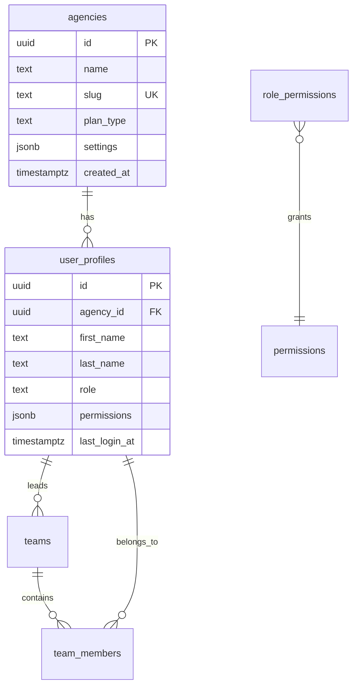
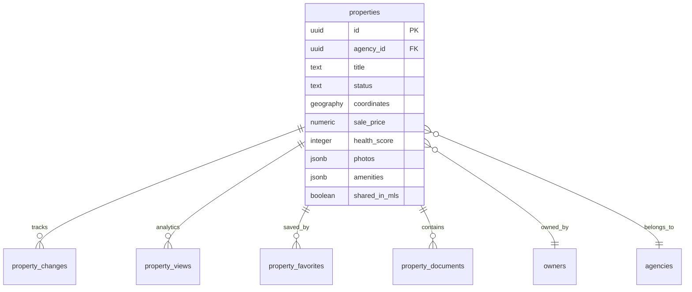
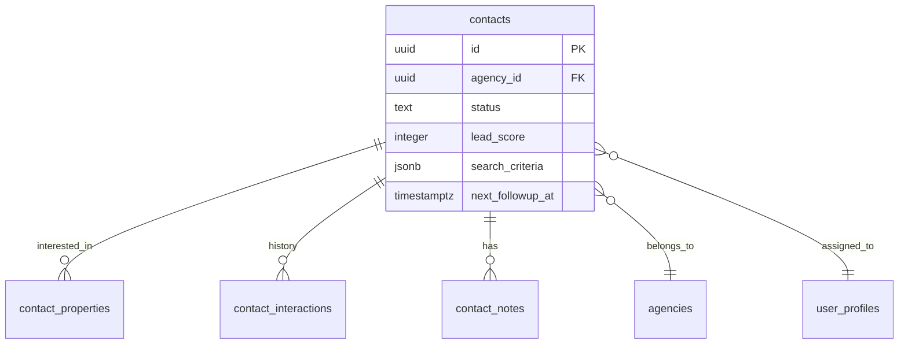
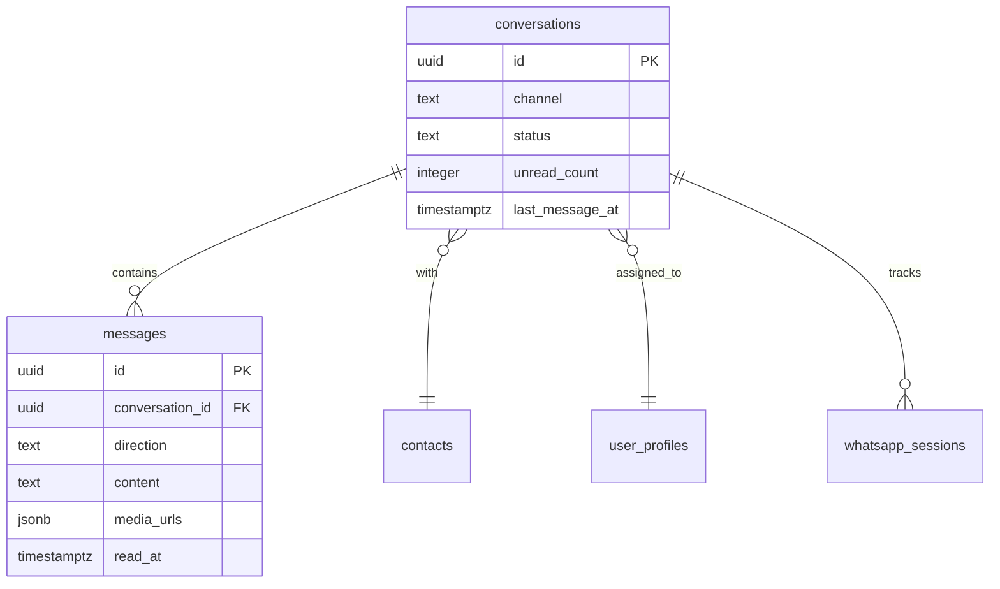
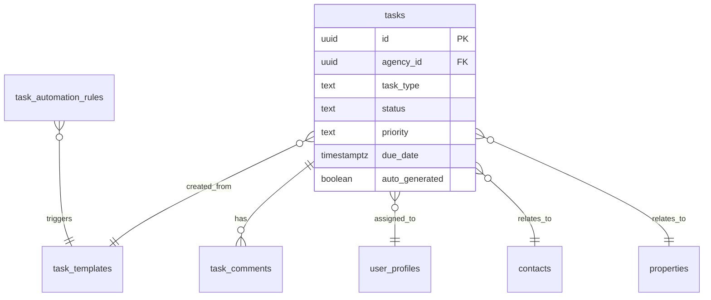

# NEXUS OS - Database Architecture Documentation

Complete database schema documentation for the NEXUS OS Real Estate CRM system.

## Overview

The NEXUS OS database is designed as a **multi-tenant real estate CRM** with comprehensive support for:
- Property management & MLS sharing
- Contact/Lead management & scoring
- Unified social inbox (WhatsApp, Instagram, Facebook, etc.)
- Intelligent task automation (Pulppo-style)
- Visits, offers, and transaction tracking
- Analytics and performance metrics

### Tech Stack
- **Database**: PostgreSQL via Supabase
- **Extensions**: PostGIS (spatial data), UUID, Full-text search
- **Security**: Row Level Security (RLS) on all tables
- **Total Tables**: 50+

---

## Database Modules

### Module 1: Core System (6 tables)

Core tables for multi-tenant support, user management, and permissions.



**Key Tables:**
- [agencies](file:///Users/manuelacosta/Desktop/Antigravity/LivooCRMAG/supabase/migrations/0001_initial_schema.sql#L19-L47) - Multi-tenant agency management
- [user_profiles](file:///Users/manuelacosta/Desktop/Antigravity/LivooCRMAG/supabase/migrations/0001_initial_schema.sql#L49-L84) - Extends `auth.users` with CRM-specific fields
- [teams](file:///Users/manuelacosta/Desktop/Antigravity/LivooCRMAG/supabase/migrations/0001_initial_schema.sql#L86-L96) - Team organization
- [team_members](file:///Users/manuelacosta/Desktop/Antigravity/LivooCRMAG/supabase/migrations/0001_initial_schema.sql#L98-L108) - Many-to-many team membership

---

### Module 2: Properties (CRITICAL - 6 tables)

The heart of the CRM - property catalog with full multimedia support, health scoring, and MLS integration.



**Properties Table** - Most important table with:
- **Location**: Full address + PostGIS coordinates for spatial searches
- **Rich Metadata**: Bedrooms, bathrooms, m2, year built, condition
- **Pricing**: Sale/rent prices with currency support
- **MLS**: Sharing flags, commission settings, exclusivity
- **Health Score** (0-100): Auto-calculated based on completeness
- **Multimedia**: Photos array, videos, virtual tours, floor plans

**Health Score Algorithm:**
```sql
SELECT calculate_property_health_score(property_id);

-- Scoring breakdown:
-- Location completeness: +10
-- 15+ photos: +20
-- Videos: +20
-- Virtual tour: +15  
-- Description 200+ chars: +20
-- 5+ amenities: +5
-- Floor plan: +10
-- MAX: 100 points
```

---

### Module 3: Real Estate Developments (4 tables)

Master projects with unit types and financial plans.

- [developments](file:///Users/manuelacosta/Desktop/Antigravity/LivooCRMAG/supabase/migrations/0001_initial_schema.sql#L364-L393) - Development projects
- [development_unit_types](file:///Users/manuelacosta/Desktop/Antigravity/LivooCRMAG/supabase/migrations/0001_initial_schema.sql#L395-L418) - Unit templates (e.g., "2BR Standard")
- [development_units](file:///Users/manuelacosta/Desktop/Antigravity/LivooCRMAG/supabase/migrations/0001_initial_schema.sql#L420-L439) - Individual units
- [development_financial_plans](file:///Users/manuelacosta/Desktop/Antigravity/LivooCRMAG/supabase/migrations/0001_initial_schema.sql#L441-L457) - Payment plans

---

### Module 4: Property Owners (3 tables)

Owner/landlord management with documents and automated reports.

- [owners](file:///Users/manuelacosta/Desktop/Antigravity/LivooCRMAG/supabase/migrations/0001_initial_schema.sql#L121-L150) - Individual or company owners
- [owner_documents](file:///Users/manuelacosta/Desktop/Antigravity/LivooCRMAG/supabase/migrations/0001_initial_schema.sql#L463-L475) - ID, contracts, tax documents
- [owner_reports](file:///Users/manuelacosta/Desktop/Antigravity/LivooCRMAG/supabase/migrations/0001_initial_schema.sql#L477-L497) - Monthly/quarterly statements

---

### Module 5: Contacts/Leads (CRITICAL - 6 tables)

Complete CRM for lead management with scoring, tagging, and interaction tracking.



**Contacts Table** - CRM core with:
- **Classification**: buyer, seller, renter, landlord, investor
- **Lead Scoring**: 0-100 score
- **Status Pipeline**: new → contacted → qualified → visiting → negotiating → closed
- **Search Criteria**: Budget, preferred zones, property types
- **Follow-up System**: `next_followup_at` for automated reminders

**Related Tables:**
- [contact_properties](file:///Users/manuelacosta/Desktop/Antigravity/LivooCRMAG/supabase/migrations/0001_initial_schema.sql#L549-L562) - Many-to-many with interest levels
- [contact_interactions](file:///Users/manuelacosta/Desktop/Antigravity/LivooCRMAG/supabase/migrations/0001_initial_schema.sql#L564-L580) - Complete history (calls, emails, meetings)
- [contact_notes](file:///Users/manuelacosta/Desktop/Antigravity/LivooCRMAG/supabase/migrations/0001_initial_schema.sql#L582-L594) - Rich text notes with attachments

---

### Module 6: Communications (CRITICAL - 5 tables)

Unified social inbox supporting 8 channels with message threading and automation.



**Supported Channels:**
- WhatsApp Business
- Instagram DM
- Facebook Messenger
- SMS
- Email
- Web Chat
- Telegram
- TikTok DM

**Key Features:**
- Bidirectional messages (inbound/outbound)
- Read receipts & delivery status
- Media attachments
- Auto-assignment to agents
- Unread counter
- AI sentiment analysis

---

### Module 7: Tasks (Intelligent System - 5 tables)

Complete tasks system with auto-generation, templates, and performance metrics.



**Key Tables:**
- [tasks](file:///Users/manuelacosta/Desktop/Antigravity/LivooCRMAG/supabase/migrations/0010_tasks_system.sql#L10-L69) - Central task management
- [task_comments](file:///Users/manuelacosta/Desktop/Antigravity/LivooCRMAG/supabase/migrations/0010_tasks_system.sql#L114-L122) - Collaboration on tasks
- [task_templates](file:///Users/manuelacosta/Desktop/Antigravity/LivooCRMAG/supabase/migrations/0010_tasks_system.sql#L141-L160) - Blueprints for recurring tasks
- [task_automation_rules](file:///Users/manuelacosta/Desktop/Antigravity/LivooCRMAG/supabase/migrations/0010_tasks_system.sql#L167-L197) - Logic for auto-generating tasks
- [task_performance_metrics](file:///Users/manuelacosta/Desktop/Antigravity/LivooCRMAG/supabase/migrations/0010_tasks_system.sql#L205-L232) - monthly agent KPIs

**Automation Triggers:**
- `calculate_task_metrics()`: Computes monthly stats per agent.
- `auto_generate_client_followup_task()`: Creates tasks for inactive leads.
- `check_overdue_tasks()`: Cron-style status updates.

**Example Usage:**
```sql
-- Create a task rule
INSERT INTO task_rules (agency_id, name, trigger_event, template_id, is_active)
VALUES (
    'agency-uuid',
    'Follow up new leads',
    'contact_created',
    'template-uuid',
    true
);

-- Tasks will auto-generate when new contacts are created
```

---

### Module 8: Visits & Offers (5 tables)

Visit scheduling, consultations, feedback, and offer management.

- [visits](file:///Users/manuelacosta/Desktop/Antigravity/LivooCRMAG/supabase/migrations/0010_tasks_system.sql#L7-L15) - In-person property tours
- [property_consultations](file:///Users/manuelacosta/Desktop/Antigravity/LivooCRMAG/supabase/migrations/0010_tasks_system.sql#L18-L24) - Lead inquiries and consultations
- [visit_feedback](file:///Users/manuelacosta/Desktop/Antigravity/LivooCRMAG/supabase/migrations/0001_initial_schema.sql#L868-L880) - Post-visit analysis
- [offers](file:///Users/manuelacosta/Desktop/Antigravity/LivooCRMAG/supabase/migrations/0001_initial_schema.sql#L882-L920) - Negotiation history
- [transactions](file:///Users/manuelacosta/Desktop/Antigravity/LivooCRMAG/supabase/migrations/0001_initial_schema.sql#L922-L957) - Closed deals

---

### Module 9: Analytics & Audit (4 tables)

Activity tracking, performance metrics, and security auditing.

- [activity_logs](file:///Users/manuelacosta/Desktop/Antigravity/LivooCRMAG/supabase/migrations/0001_initial_schema.sql#L963-L979) - User activity tracking
- [sales_funnel_stages](file:///Users/manuelacosta/Desktop/Antigravity/LivooCRMAG/supabase/migrations/0001_initial_schema.sql#L983-L999) - Custom funnel definitions
- [agent_performance](file:///Users/manuelacosta/Desktop/Antigravity/LivooCRMAG/supabase/migrations/0001_initial_schema.sql#L1001-L1024) - Agent KPIs and metrics
- [audit_logs](file:///Users/manuelacosta/Desktop/Antigravity/LivooCRMAG/supabase/migrations/0001_initial_schema.sql#L1026-L1047) - Security audit trail

---

## Common Queries

### Find Properties Near Location
```sql
-- Find properties within 5km of a point
SELECT 
    id, title, sale_price,
    ST_Distance(coordinates, ST_MakePoint(-99.1332, 19.4326)::geography) / 1000 AS distance_km
FROM properties
WHERE 
    agency_id = 'your-agency-id'
    AND status = 'active'
    AND ST_DWithin(
        coordinates,
        ST_MakePoint(-99.1332, 19.4326)::geography,
        5000  -- 5km in meters
    )
ORDER BY distance_km;
```

### Get Contact Pipeline
```sql
-- Count contacts by status
SELECT 
    status,
    COUNT(*) as count,
    AVG(lead_score) as avg_score
FROM contacts
WHERE 
    agency_id = 'your-agency-id'
    AND deleted_at IS NULL
GROUP BY status
ORDER BY 
    CASE status
        WHEN 'new' THEN 1
        WHEN 'contacted' THEN 2
        WHEN 'qualified' THEN 3
        WHEN 'visiting' THEN 4
        WHEN 'negotiating' THEN 5
        WHEN 'closed_won' THEN 6
        WHEN 'closed_lost' THEN 7
    END;
```

### Unified Inbox - Unread Messages
```sql
-- Get all unread conversations with latest message
SELECT 
    c.id,
    c.channel,
    c.unread_count,
    c.last_message_at,
    ct.first_name || ' ' || ct.last_name AS contact_name,
    up.first_name || ' ' || up.last_name AS assigned_agent
FROM conversations c
LEFT JOIN contacts ct ON c.contact_id = ct.id
LEFT JOIN user_profiles up ON c.assigned_to = up.id
WHERE 
    c.agency_id = 'your-agency-id'
    AND c.status = 'open'
    AND c.unread_count > 0
ORDER BY c.last_message_at DESC;
```

### Agent Performance Summary
```sql
-- Get agent stats for current month
SELECT 
    up.first_name || ' ' || up.last_name AS agent_name,
    COUNT(DISTINCT p.id) FILTER (WHERE p.created_at >= date_trunc('month', NOW())) AS properties_listed,
    COUNT(DISTINCT t.id) FILTER (WHERE t.status = 'completed') AS transactions_closed,
    COALESCE(SUM(t.commission_amount), 0) AS total_commission
FROM user_profiles up
LEFT JOIN properties p ON p.producer_id = up.id
LEFT JOIN transactions t ON t.agent_id = up.id
WHERE 
    up.agency_id = 'your-agency-id'
    AND up.role = 'agent'
GROUP BY up.id, up.first_name, up.last_name
ORDER BY total_commission DESC;
```

### Top Properties by Health Score
```sql
-- Find properties with low health scores that need attention
SELECT 
    id,
    title,
    status,
    health_score,
    CASE 
        WHEN jsonb_array_length(photos) < 15 THEN 'Need more photos'
        WHEN videos IS NULL OR jsonb_array_length(videos) = 0 THEN 'Need video'
        WHEN length(description) < 200 THEN 'Improve description'
        ELSE 'OK'
    END AS suggestion
FROM properties
WHERE 
    agency_id = 'your-agency-id'
    AND status IN ('draft', 'active')
    AND health_score < 70
ORDER BY health_score ASC
LIMIT 20;
```

---

## Row Level Security (RLS)

All tables have RLS enabled for **multi-tenant isolation**. Users can only see data from their own agency.

### Key RLS Functions

```sql
-- Get current user's agency
SELECT auth.user_agency_id();

-- Check if user is admin
SELECT auth.is_admin();

-- Check specific permission
SELECT auth.has_permission('properties.delete');
```

### Example Policy

```sql
-- Users only see properties from their agency OR shared in MLS
CREATE POLICY "Users see properties from their agency"
ON properties FOR SELECT
USING (
    agency_id = auth.user_agency_id()
    OR (shared_in_mls = true AND status = 'active')
);
```

---

## Triggers & Automation

### Auto-updating Timestamps
All tables with `updated_at` have triggers that auto-update on modification.

### Property Health Score
Automatically recalculated on INSERT/UPDATE:
```sql
-- Trigger fires automatically
UPDATE properties 
SET description = 'New long description...' 
WHERE id = 'property-uuid';
-- health_score is auto-updated
```

### Task Auto-generation
When specific events occur, tasks are auto-created based on active rules:
```sql
-- When a property is created, triggers check task_rules
-- and auto-generate tasks from templates
INSERT INTO properties (...) VALUES (...);
-- Auto-generated tasks appear in tasks table
```

### Conversation Updates
When a new message is inserted, the conversation is auto-updated:
- `last_message_at` timestamp
- `last_message_from` (contact or agent)
- `unread_count` incremented (if inbound)

---

## Migration Files

Apply migrations in order via Supabase SQL Editor:

1. [0001_initial_schema.sql](file:///Users/manuelacosta/Desktop/Antigravity/LivooCRMAG/supabase/migrations/0001_initial_schema.sql) - All 50+ tables
2. [0002_functions_and_triggers.sql](file:///Users/manuelacosta/Desktop/Antigravity/LivooCRMAG/supabase/migrations/0002_functions_and_triggers.sql) - Functions and triggers
3. [0003_indexes.sql](file:///Users/manuelacosta/Desktop/Antigravity/LivooCRMAG/supabase/migrations/0003_indexes.sql) - Performance indexes
4. [0004_rls_policies.sql](file:///Users/manuelacosta/Desktop/Antigravity/LivooCRMAG/supabase/migrations/0004_rls_policies.sql) - Security policies

---

## Adding New Tables

When extending the schema:

1. **Create migration file** with timestamp:
   ```bash
   touch supabase/migrations/$(date +%Y%m%d%H%M%S)_add_your_feature.sql
   ```

2. **Add table with standard fields**:
   ```sql
   CREATE TABLE your_table (
       id UUID PRIMARY KEY DEFAULT gen_random_uuid(),
       agency_id UUID REFERENCES agencies(id) NOT NULL,
       -- your fields here
       created_at TIMESTAMPTZ DEFAULT NOW(),
       updated_at TIMESTAMPTZ DEFAULT NOW()
   );
   ```

3. **Enable RLS**:
   ```sql
   ALTER TABLE your_table ENABLE ROW LEVEL SECURITY;
   
   CREATE POLICY "Users see records from their agency"
   ON your_table FOR SELECT
   USING (agency_id = auth.user_agency_id());
   ```

4. **Add indexes**:
   ```sql
   CREATE INDEX idx_your_table_agency ON your_table(agency_id);
   ```

5. **Add updated_at trigger**:
   ```sql
   CREATE TRIGGER set_updated_at_your_table
       BEFORE UPDATE ON your_table
       FOR EACH ROW
       EXECUTE FUNCTION trigger_set_updated_at();
   ```

---

## Performance Tips

### Spatial Queries
Use PostGIS for location searches:
```sql
-- GOOD: Uses spatial index
WHERE ST_DWithin(coordinates, ST_MakePoint(lng, lat)::geography, 5000)

-- BAD: Table scan
WHERE ST_Distance(coordinates, ST_MakePoint(lng, lat)::geography) < 5000
```

### Full-text Search
Use the GIN indexes:
```sql
-- Search properties by title/description
WHERE to_tsvector('spanish', title || ' ' || description) 
      @@ to_tsquery('spanish', 'casa & cdmx');
```

### JSON Queries
Index JSONB columns when querying frequently:
```sql
CREATE INDEX idx_properties_amenities 
ON properties USING GIN (amenities);

-- Then query efficiently
WHERE amenities @> '["pool"]'::jsonb;
```

---

## Backup & Restore

Supabase handles automated backups. To export:

```bash
# Export via Supabase CLI
supabase db dump -f backup.sql

# Restore
psql $DATABASE_URL < backup.sql
```

---

## Support

For questions or issues with the database schema:
- Check migration files in `/supabase/migrations/`
- Review RLS policies in `0004_rls_policies.sql`
- See function definitions in `0002_functions_and_triggers.sql`
