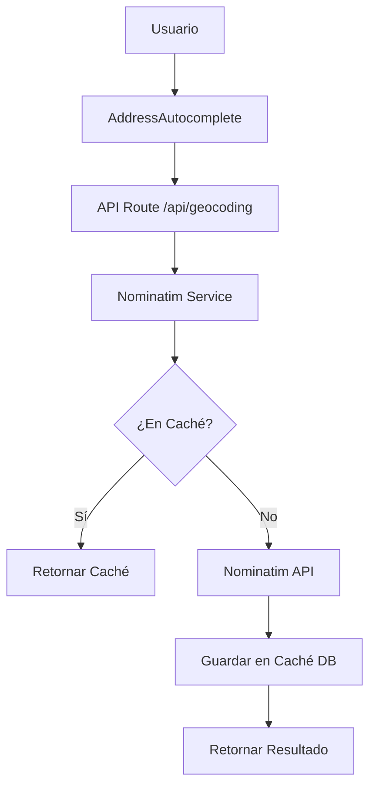

# Servicio de Geocoding con Nominatim

## Motivación
- **Google Geocoding:** $5/1000 requests = $15,000/año
- **Nominatim:** Gratis (con rate limit)
- **Ahorro anual:** $15,000 USD

## Arquitectura


### Rate Limiting
- **Límite:** 1 request/segundo (estricto).
- **Implementación:** El servicio incluye un delay interno para garantizar que no se exceda el límite.
- **Caché:** Se espera que más del 90% de las peticiones se sirvan desde la base de datos.

## Uso

### Geocodificar dirección (Backend/Server)
```typescript
import { geocodeAddress } from '@/lib/geocoding/nominatim'

const result = await geocodeAddress('Av. Reforma 222, Juárez, CDMX')
// { lat: '19.4260', lon: '-99.1690', display_name: '...', address: {...} }
```

### Reverse Geocoding (Backend/Server)
```typescript
import { reverseGeocode } from '@/lib/geocoding/nominatim'

const result = await reverseGeocode(19.4326, -99.1332)
// { display_name: 'Ciudad de México, México', address: {...} }
```

### Autocomplete (Frontend)
Usar el componente `AddressAutocomplete`:
```tsx
import { AddressAutocomplete } from '@/components/shared/AddressAutocomplete'

<AddressAutocomplete 
    onSelect={(result) => console.log(result)} 
    placeholder="Buscar propiedad..." 
/>
```

## Caché en Base de Datos
- Tabla: `geocoding_cache`
- Almacena resultados completos en JSONB.
- Índice por `normalized_query` para búsquedas instantáneas.
- No expira automáticamente, pero existe una función de limpieza para registros > 6 meses sin uso.

## Limitaciones
- Uso personal/interno (no comercial masivo).
- Rate limit de 1 req/seg.
- Requiere User-Agent identificado (`LivooCRM/1.0`).

## Alternativas de Fallback
Si Nominatim no es suficiente:
- **MapBox Geocoding:** 100K requests/mes gratis.
- **LocationIQ:** 10K requests/día gratis.
- **HERE Maps:** 250K requests/mes gratis.
