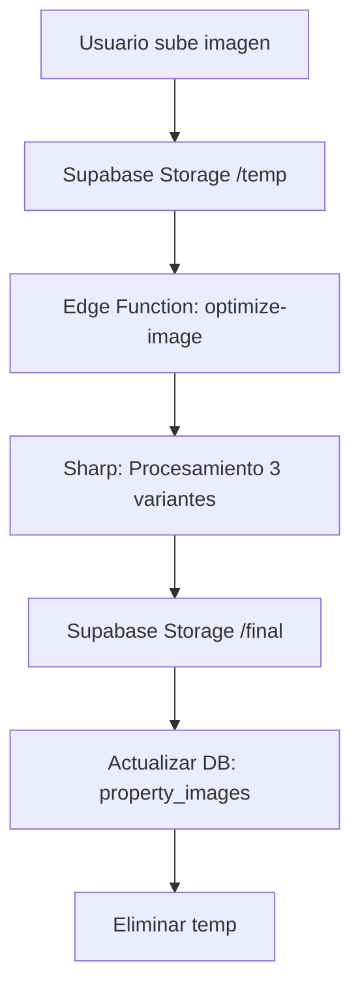

# Sistema de Optimización de Imágenes

## Arquitectura
El sistema procesa imágenes de forma asíncrona mediante una Edge Function de Supabase utilizando la librería **Sharp**.



## Variantes Generadas
Todas las imágenes se convierten a formato **WebP** para máxima eficiencia.

| Variante | Dimensiones | Calidad | Uso Principal |
| :--- | :--- | :--- | :--- |
| **Thumbnail** | 300×200px | 70 | Listados y miniaturas |
| **Medium** | 800×600px | 80 | Galerías y detalles |
| **Large** | 1920×1080px | 85 | Lightbox / Pantalla completa |

## Componentes

### 1. `ImageUpload`
Componente con Drag & Drop que maneja el ciclo de vida del componente:
- Feedback visual de subida.
- Estado de procesamiento (Edge Function).
- Estadísticas de ahorro de espacio.

### 2. `PropertyImage`
Componente optimizado para mostrar las variantes:
- Lazy loading automático.
- Cambio inteligente de resolución (srcset).
- Placeholder de carga.

## Límites y Reglas
- **Formatos aceptados:** JPG, PNG, WebP.
- **Tamaño máximo:** 10MB por archivo.
- **Límite de archivos:** 12 por propiedad.
- **Primary Image:** La primera imagen cargada se marca automáticamente como principal (`is_primary`).

## Mantenimiento
Para depurar errores, revisar los logs de la Edge Function:
```bash
supabase functions logs optimize-image
```
